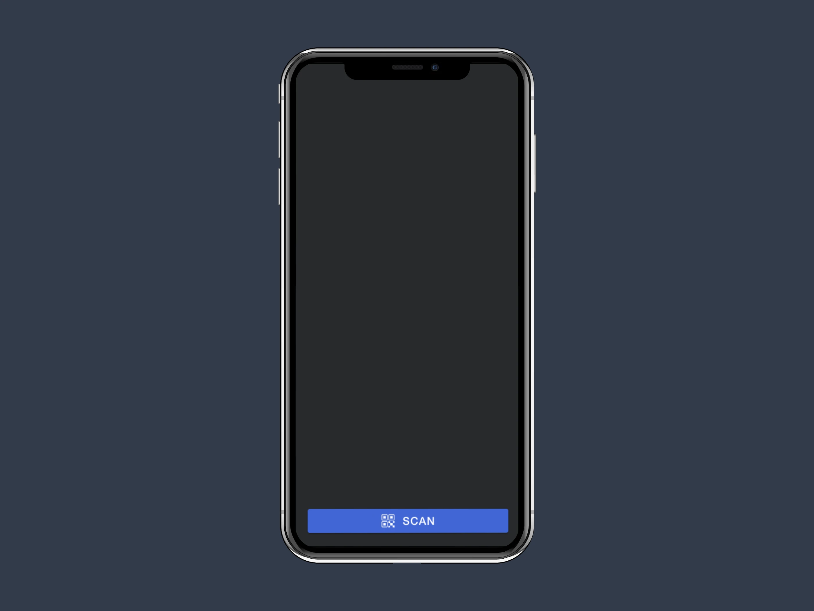
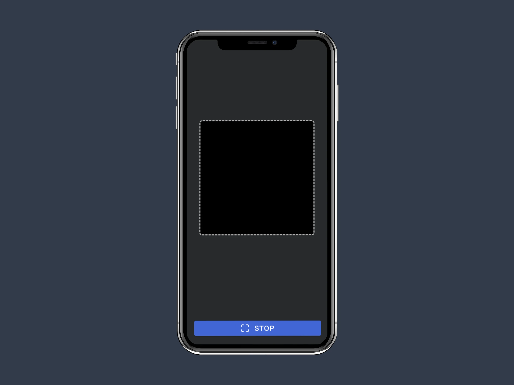
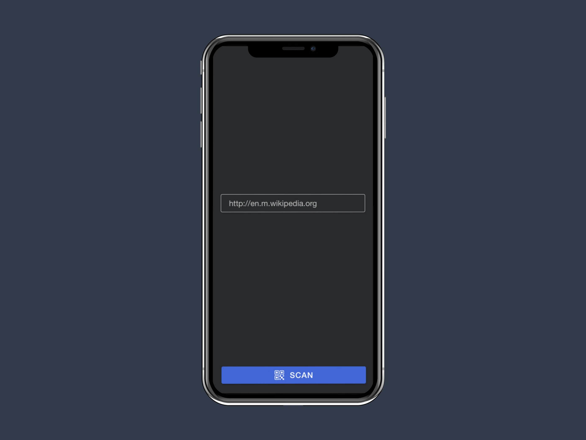

# QR Scanner

Simple QR code scanner built with Ionic

## Table of Contents

- [QR Scanner](#qr-scanner)
  - [Table of Contents](#table-of-contents)
  - [Introduction](#introduction)
  - [Features](#features)
  - [Installation](#installation)
    - [Prerequisites](#prerequisites)
    - [Steps](#steps)
  - [Add and Run on Android/iOS](#add-and-run-on-androidios)
    - [Add Android/iOS Platform](#add-androidios-platform)
    - [Run on a Device or Emulator](#run-on-a-device-or-emulator)
  - [Build](#build)
    - [Building for iOS and Android](#building-for-ios-and-android)
  - [Screenshots](#screenshots)
  - [Contributing](#contributing)
    - [Commit Message Guidelines](#commit-message-guidelines)
  - [License](#license)

## Introduction

The QR Scanner app allows users to scan QR codes efficiently and easily by immediately displaying the scanned information.

## Features

- **Fast and Reliable**: Scan QR codes quickly and efficiently
- **Cross-platform Compatibility**: Works seamlessly on both Android and iOS devices.

## Installation

### Prerequisites

Before starting, ensure you have the following tools installed:

- [Node.js](https://nodejs.org/) (v18.20.5) & [NPM](https://www.npmjs.com/) (v10.8.2). Recommended use of [NVM](https://github.com/nvm-sh/nvm) (v0.39.3)
- [Angular CLI](https://angular.dev/) (v16.2.16)
- [Ionic Framework](https://ionicframework.com/) (v7.2.0, for building cross-platform apps)
- [Capacitor](https://capacitorjs.com/) (For integrating native mobile support and functionality)
- [Android Studio](https://developer.android.com/studio) (For Android development)
- [Xcode](https://developer.apple.com/xcode/) (For iOS development, if you plan to run the app on macOS)

### Steps

1. Clone this repository:

   ```sh
   git clone https://github.com/hectorOliSan/qr-scanner.git
   cd qr-scanner
   ```

2. Install dependencies:

  Install the necessary Node.js dependencies with:

   `npm install --force`

3. Run the app:

   Serve the app in a local development server to view it in the browser:

   `ionic serve` or `ionic serve --host=0.0.0.0 --ssl`

4. Open your browser and navigate to `http://localhost:8100` to see the app in action.

## Add and Run on Android/iOS

### Add Android/iOS Platform

1. To add the Android platform, use:

   `ionic cap add android`

2. To add the iOS platform, use:

   `ionic cap add ios`

### Run on a Device or Emulator

1. To run the app on an Android device or emulator:

   `ionic cap run android`

2. To run the app on an iOS device or simulator:

   `ionic cap run ios`

Ensure you have the necessary SDKs installed (e.g., Android Studio for Android, Xcode for iOS).

## Build

To build the app for production and generate an optimized version for distribution:

   `ionic build` or `ionic build --prod`

This command will create a production-ready build in the www directory.

### Building for iOS and Android

Once you have added the platforms, you can build the app using:

- For Android:

   ```sh
   ionic cap sync android
   ionic cap open android
   ```

This opens Android Studio where you can create an APK or run the app on a connected device.

- For iOS:

   ```sh
   ionic cap sync ios
   ionic cap open ios
   ```

This opens Xcode where you can run the app on an iOS simulator or device.

## Screenshots

Here are some screenshots of the QR Scanner app in action:

- **Home Screen**: A clean and intuitive interface for scanning QR codes.

  </img>

- **Scanner in Action**: Shows the camera in a box where you can scan the QR

  </img>

- **Scanned QR Code**: The app displaying the results (e.g., a URL).

  </img>


## Contributing

Contributions to the QR Scanner project are appreciated! Follow these steps to contribute:

1. Fork the repository.
2. Create a new branch for your feature or bugfix.
3. Commit your changes and push them to your fork.
4. Open a pull request.

### Commit Message Guidelines

This project follows the [Conventional Commits](https://www.conventionalcommits.org/en/v1.0.0/) specification for commit messages. Please use the following format for your commit messages:

| Type     | Description                                                          |
| -------- | -------------------------------------------------------------------- |
| feat     | A new feature for the user.                                          |
| fix       | A bug fix for the user.                                               |
| docs     | Documentation only changes.                                          |
| style    | Code style changes (formatting, missing semicolons, etc).            |
| refactor | A code change that neither fixes a bug nor adds a feature.            |
| perf     | A code change that improves performance.                             |
| test     | Adding or updating tests.                                            |
| chore    | Routine tasks such as updating dependencies or build configurations.  |
| build    | Changes that affect the build system or external dependencies.       |
| ci       | Changes to the continuous integration configuration or scripts.       |
| revert   | Reverts a previous commit.                                           |

Examples:

- Adding a new feature: `feat: add QR code scanner functionality`
- Fixing a bug: `fix: resolve crash on invalid QR code`
- Updating documentation: `docs: update README with new setup instructions`
- Improving performance: `perf: optimize QR code decoding for faster scanning`

All contributions are subject to review and using the project's coding style and best practices.

## License

This project is licensed under the MIT License.
